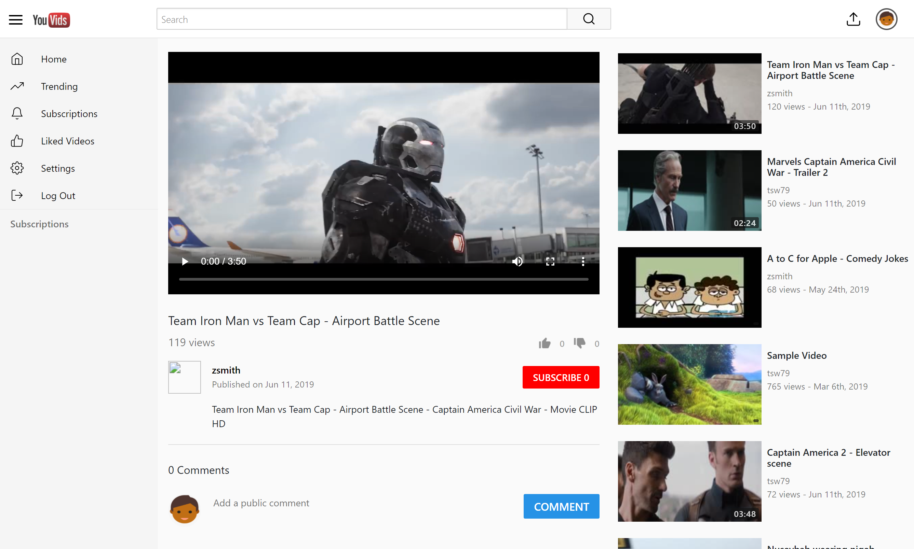

  

# YouVids - A YouTube-clone video-sharing platform

A simple video-sharing platform created with PHP, Javascriopt and CSS.

## General info

This project is a simple demonstration of using PHP 7.3 features.

Note: This project makes use of ffmpeg:
* Zeranoe FFmpeg Builds <http://ffmpeg.zeranoe.com/builds/>
* ***Build***: ffmpeg-20190301-3b23eb2-win64-static